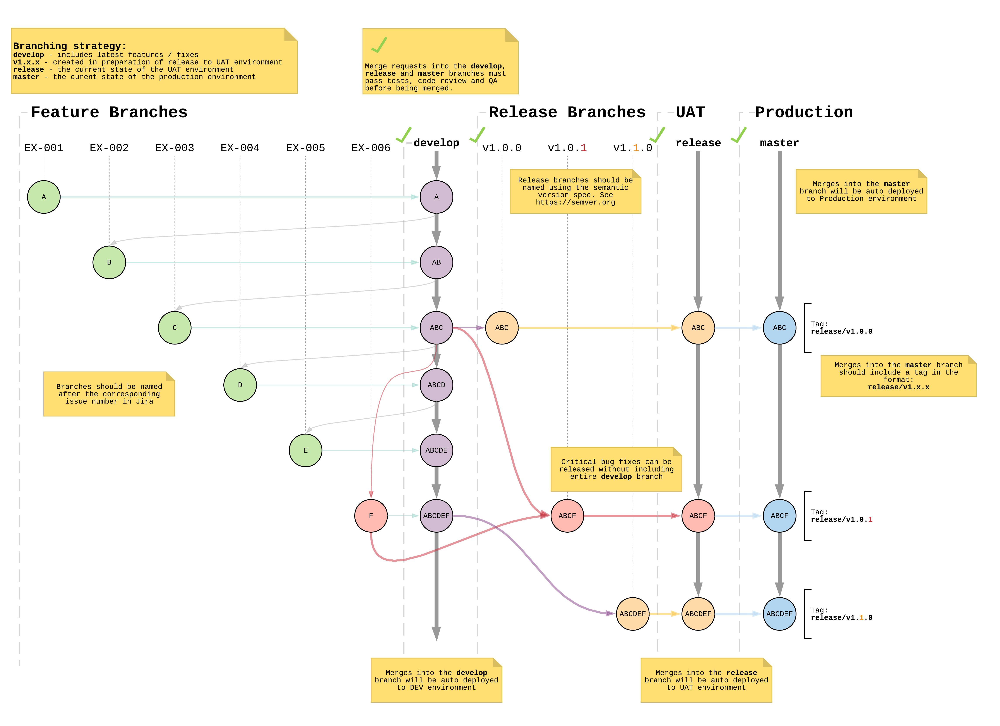
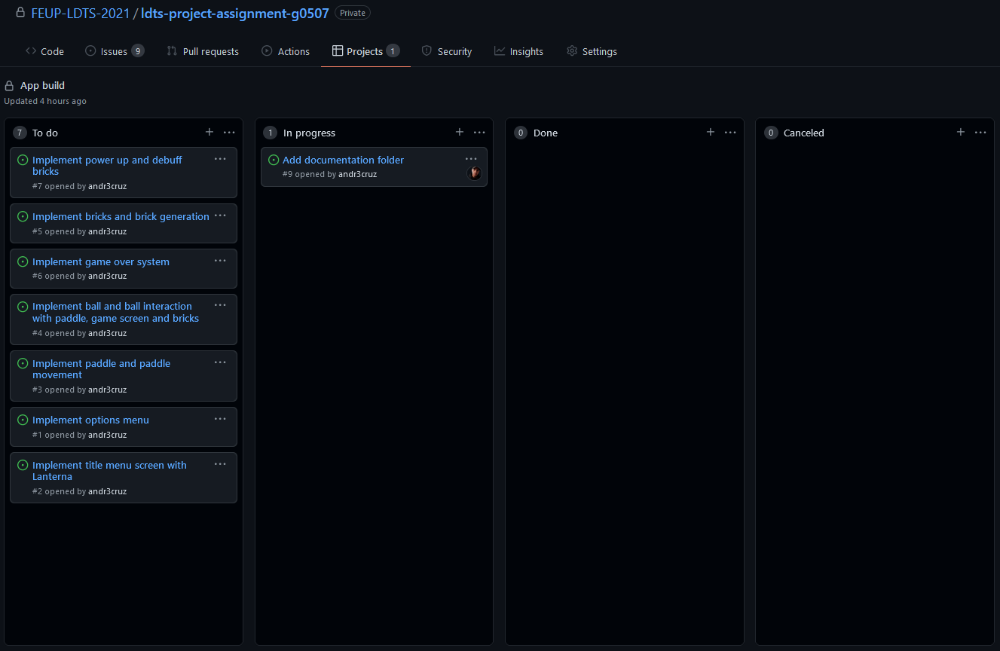
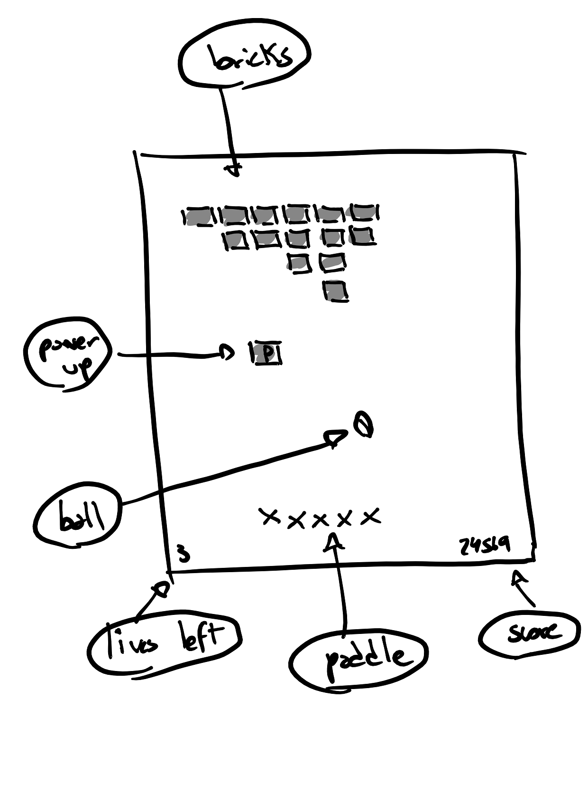
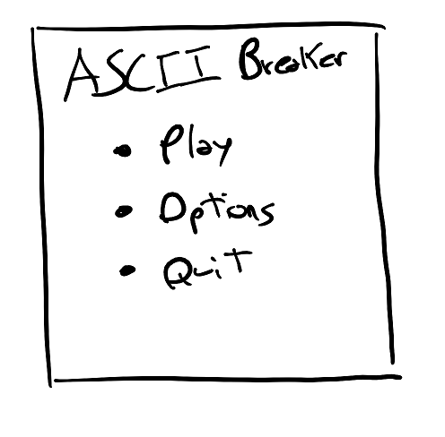
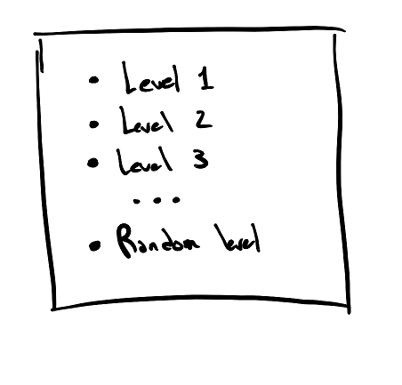
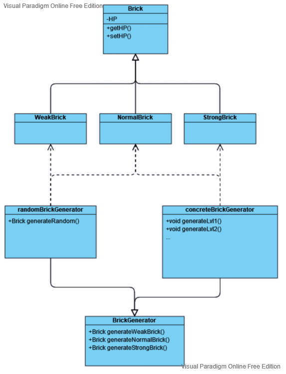

# LDTS_T05_G07
# ASCII Breaker

## Game Description

**ASCII Breaker** is a brick breaker based game where the player must smash a wall of bricks by deflecting a bouncing ball with a paddle which may only be moved horizontally. The player starts with 3 lives and loses one each time the ball hits the bottom of the screen.
The variety of levels will have increased difficulty by adding different kinds of bricks, changing ball speed and adding special power ups and handicaps for the player.

This project was developed for LDTS 2021-22 by:

- **_Ana Reis_** (*up201905529*@fe.up.pt) </LI>
- **_Andre Cruz_** (*up201705768*@fc.up.pt) </LI>
- **_Angy da Cruz_** (*up202007253*@fc.up.pt) </LI>

## Workflow

### Git workflow
This project is being developed following the **_Feature Branches Workflow_**

This is done by doing all feature development under feature branches which then merge into the **developing** branch. This is in order to facilitate collaboration between the various contributors and to not disturb the main codebase by encapsulating the **main** branch only for **releases**.

  

  <b><i>Fig 1. Feature branches workflow</i></b>

### Project board
Feature branches will be named according to the card number in our Project page, this is also done in order to improve the workflow between the various contributors, for example development for card #9 would be done under branch CA-09.

  

  <b><i>Fig 2. Github Project board</i></b>

### Version naming

All releases will also be named following the semantic version spec. See [https://semver.org]()

## Planned Features

  

  <b><i>Fig 3. Gameplay</i></b>

- **Connected Menus** - The player can browse through several menus. (Play, Options, Quit).

  

  <b><i>Fig 4. Menu screen</i></b>

- **Level generation** - The player can play through the prebuilt levels or a randomly generated level.

  

  <b><i>Fig 5. Play submenu screen</i></b>

- **Collision detection** - Collisions between all game elements are verified (Paddle, Ball, Bricks, Game border).
- **Life system** - Players have a finite mount of lives and when they reach 0 its Game Over.
- **Object customization** - The player can select different character types for several of the game's elements (Paddle, Ball, Bricks)

## Design

### General Structure

#### Problem in Context:
Our first decision when planning the structure of the game, was to define the **_Architectural Pattern_** that would be used. Since our game will be heavily reliant on a GUI, data and game states, we needed a model that would let us encapsulate these different components and facilitate communication between them.

#### Pattern:
For this we decided to follow the **_Model-View-Controller_** pattern for implementation, which lets us separate the application's logic from its interface, where we have the **_Model_** as the brain of the app containing all the logic for it, the **_View_** which simply presents data from the model to the user and the **_Controller_** which is the communication point between the first two components and handles all requests.

  

  <b><i>Fig 6. MVC Design Pattern</i></b>

#### Implementation:

#### Consequences:
Some benefits of this implementation are:
- App logic is separated from the GUI
- Easier unit testing
- Increased scalability. Modifications are easier to implement due to responsibility separation
### Brick Generation

#### Problem in Context:

#### Pattern:
We have applied the **_Factory Method_** pattern. This pattern lets us define an interface or abstract class for creating an object but let the subclasses decide which class to instantiate. In other words, subclasses are responsible for the creation of the instance of the class. This is useful in our brick generation since we will be generating several types of bricks with minor differences between them, and we also want to have several ways or handling this generation.

  

  <b><i>Fig 7. Brick Generation UML</i></b>

#### Implementation:

#### Consequences:
Some benefits of this implementation are:
- Avoiding tight coupling the creator and product of these classes.
- Extensibility. It is possible to implement new products in the future without altering source code.
- Straightforward testing. We can test all creator classes individually and independently of the class that is being called out.

## Known Code Smells and Refactoring Suggestion
#### **Brick Generation**
We are using the Factory method Pattern for this implementation, which lets us more easily expand our number of Bricks by adding new classes, however the majority of these Brick classes only contain an HP variable and could also easily simply be a method inside the creator instead of a Class by itself.

## Testing

### Test coverage report

  

  <b><i>Fig 8. Test coverage</i></b>

### Mutation testing report

## Self-evaluation