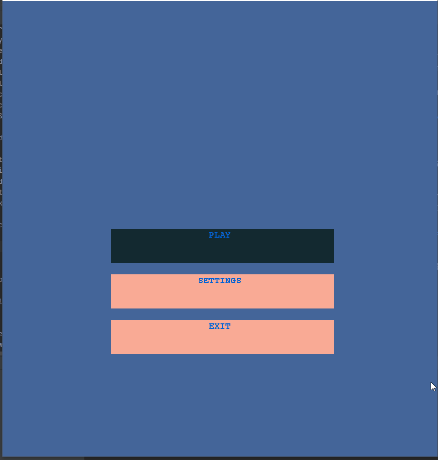
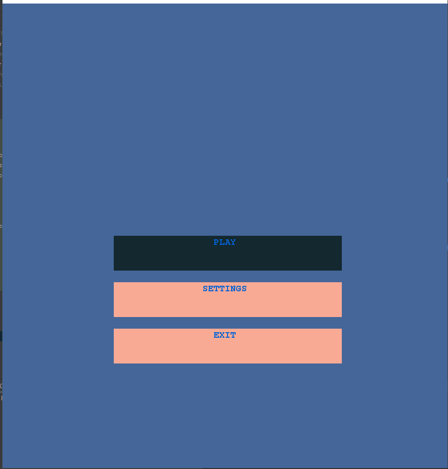
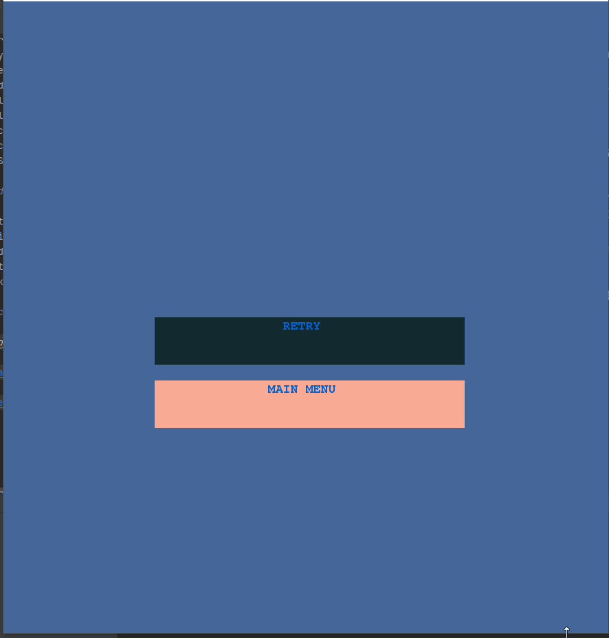
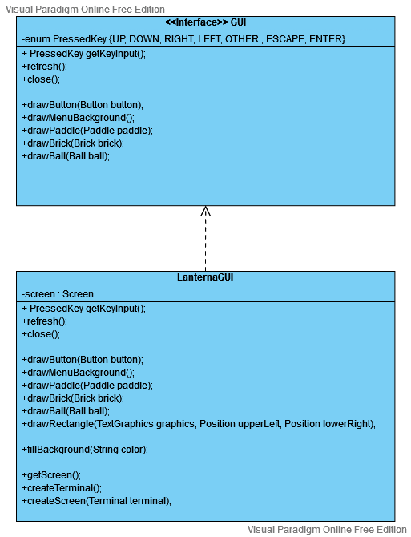
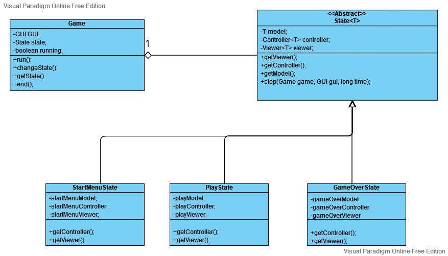
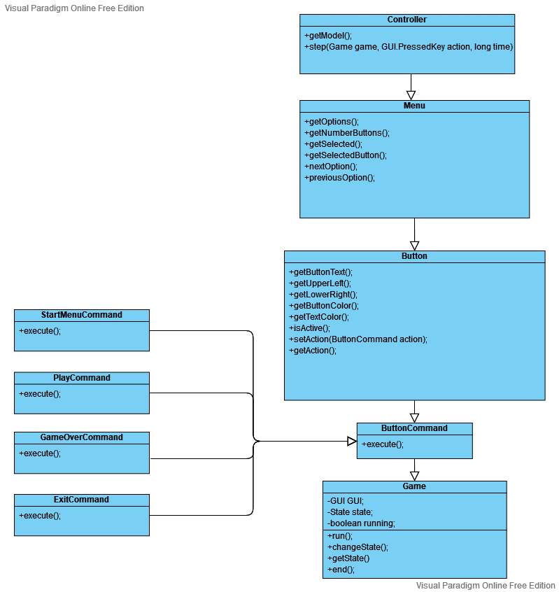
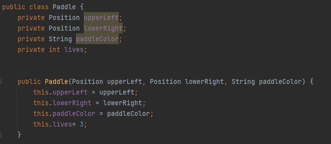
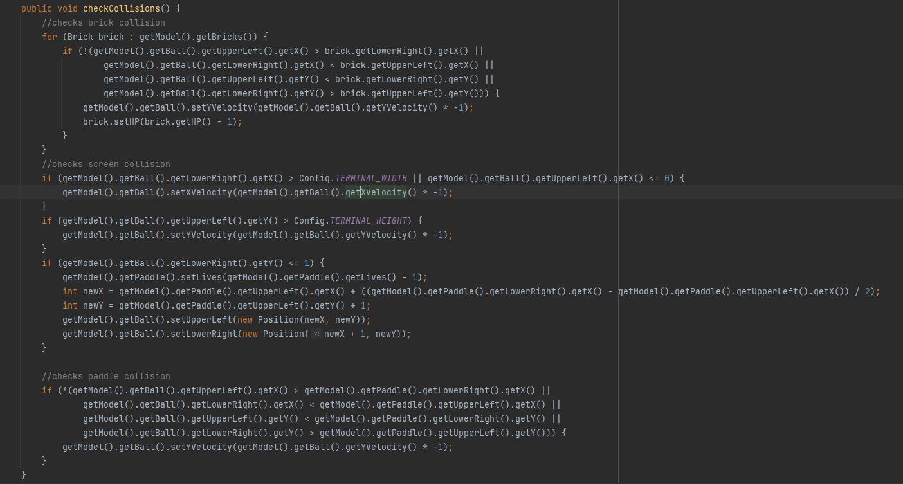
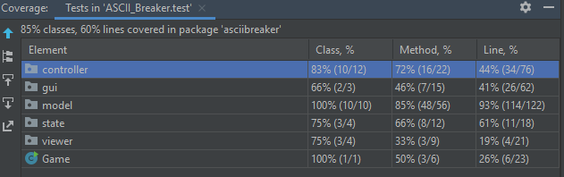

# LDTS_T05_G07
# ASCII Breaker

## Game Description

**ASCII Breaker** is a brick breaker based game where the player must smash a wall of bricks by deflecting a bouncing ball with a paddle which may only be moved horizontally. The player starts with 3 lives and loses one each time the ball hits the bottom of the screen.
The variety of levels will have increased difficulty by adding different kinds of bricks, changing ball speed and adding special power ups and handicaps for the player.

This project was developed for LDTS 2021-22 by:

- **_Ana Reis_** (*up201905529*@fe.up.pt) </LI>
- **_Andre Cruz_** (*up201705768*@fc.up.pt) </LI>
- **_Angy da Cruz_** (*up202007253*@fc.up.pt) </LI>

## Workflow

### Git workflow
This project is being developed following the **_Feature Branches Workflow_**

This is done by doing all feature development under feature branches which then merge into the **developing** branch. This is in order to facilitate collaboration between the various contributors and to not disturb the main codebase by encapsulating the **main** branch only for **releases**.

### Project board
Feature branches will be named according to the card number in our Project page, this is also done in order to improve the workflow between the various contributors, for example development for card #9 would be done under branch CA-09.

### Version naming

All releases will also be named following the semantic version spec. See [https://semver.org]()

## Implemented Features

- [x] Start Menu
- [x] Play mode
- [x] Game Over Menu
- [x] Paddle Movement
- [x] Ball Movement
- [x] Collision Detection
- [x] Bricks
- [x] Concrete Level Generation
- [x] HP System

## Planned Features

- [ ] Settings Menu
- [ ] Various Brick Types
- [ ] Random Level Generation
- [ ] Multiple Levels
- [ ] Background Music

## Game Screenshots

## Design

### General Structure

#### Problem in Context:
Our first decision when planning the structure of the game, was to define the **_Architectural Pattern_** that would be used. Since our game will be heavily reliant on a GUI, data and game states, we needed a model that would let us encapsulate these different components and facilitate communication between them.

#### Pattern:
For this we decided to follow the **_Model-View-Controller_** pattern for implementation, which lets us separate the application's logic from its interface, where we have the **_Model_** as the brain of the app containing all the logic for it, the **_View_** which simply presents data from the model to the user and the **_Controller_** which is the communication point between the first two components and handles all requests.

#### Implementation:

#### Consequences:
Some benefits of this implementation are:
- App logic is separated from the GUI
- Easier unit testing
- Increased scalability. Modifications are easier to implement due to responsibility separation
### Brick Generation

#### Problem in Context:

#### Pattern:
We have applied the **_Factory Method_** pattern. This pattern lets us define an interface or abstract class for creating an object but let the subclasses decide which class to instantiate. In other words, subclasses are responsible for the creation of the instance of the class. This is useful in our brick generation since we will be generating several types of bricks with minor differences between them, and we also want to have several ways or handling this generation.

#### Implementation:

#### Consequences:
Some benefits of this implementation are:
- Avoiding tight coupling the creator and product of these classes.
- Extensibility. It is possible to implement new products in the future without altering source code.
- Straightforward testing. We can test all creator classes individually and independently of the class that is being called out.

### Lanterna GUI

#### Problem in Context:

While using Lanterna's framework we needed a way to simplify it in order to use only the parts that we need in our project, for this we found the Facade pattern which would enable us to create a very simple interface for this complex framework.

#### Pattern:

Facade is a structural design pattern that provides a simplified interface to a library, a framework, or any other complex set of classes.
#### Implementation:

#### Consequences:

Some benefits of this implementation are:
- Decoupling of our game and the framework
- Easier to read code
- Simple interface for a complex framework

### State Pattern

#### Problem in Context:

While developing the application we needed a way to alternate between the game states, for this we decided to use the State Design Pattern.

#### Pattern:

The State Design Pattern will allow s to alter an object's behaviour when its internal state changes.

#### Implementation:

#### Consequences:
Some benefits of this implementation are:
- Easier state creation and handling
- Separate and localized behaviour for each state.
- Easier state transitioning

### Command Pattern

#### Problem in Context:

Our various Menu's had to have an object responsible for the management of the several States, which shouldn't be assigned neither to the View nor the Model, so for this we decided to have Commands which would be triggered by the Controllers for the switching of the several game States.

#### Pattern:

The Command Design Pattern is a behavioral design pattern in which an object is used to encapsulate all information needed to perform an action or trigger an event at a later time.

#### Implementation:

#### Consequences:
Some benefits of this implementation are:
- Decoupling of the Views and Controllers
- Easier to add new Button Commands to Views in the future.

## Known Code Smells and Refactoring Suggestion
#### Brick Generation
We are using the Factory method Pattern for this implementation, which lets us more easily expand our number of Bricks by adding new classes, however the majority of these Brick classes only contain an HP variable and could also easily simply be a method inside the creator instead of a Class by itself.

#### Player HP
In the current implementation we have the player's HP value stored in the Paddle object, which is not ideal since we might want to have a feature in the future where we can duplicate the paddles for example, which will break the current implementation.

#### Extracting Variables
We have complicated boolean expressions used in our collision detection functions that could be refactored by extracting the variables out of the if statement.

## Testing

### Test coverage report

## Self-evaluation

| Name                 |     Contribution     |
| -------------------- | -------------------- | 
| André Cruz           |         3/3          |
| Angy da Cruz         |         1/3          |
| Ana Reis             |                      |
